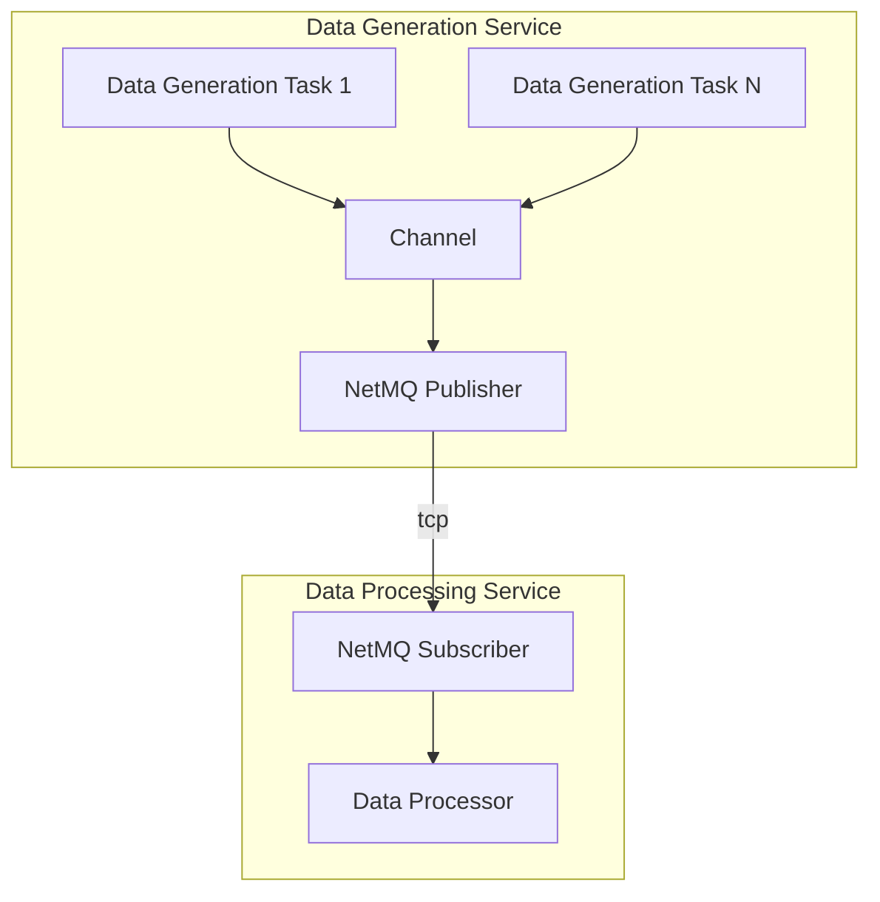

# ZeroMQPubSubSample

Example of using NetMQ ( ZeroMQ C# port) in publish–subscribe scenario.

```mermaid
graph TD
    subgraph Data Generation Service
        DG1[Data Generation Task 1]
        DGN[Data Generation Task N]
        DG1 --> Channel
        DGN --> Channel
        Channel --> NetMQPublisher[NetMQ Publisher]
    end
    
    NetMQPublisher -- tcp --> NetMQSubscriber[NetMQ Subscriber]
    
    subgraph Data Processing Service
        NetMQSubscriber --> DataProcessor[Data Processor]
    end
```

### Example

