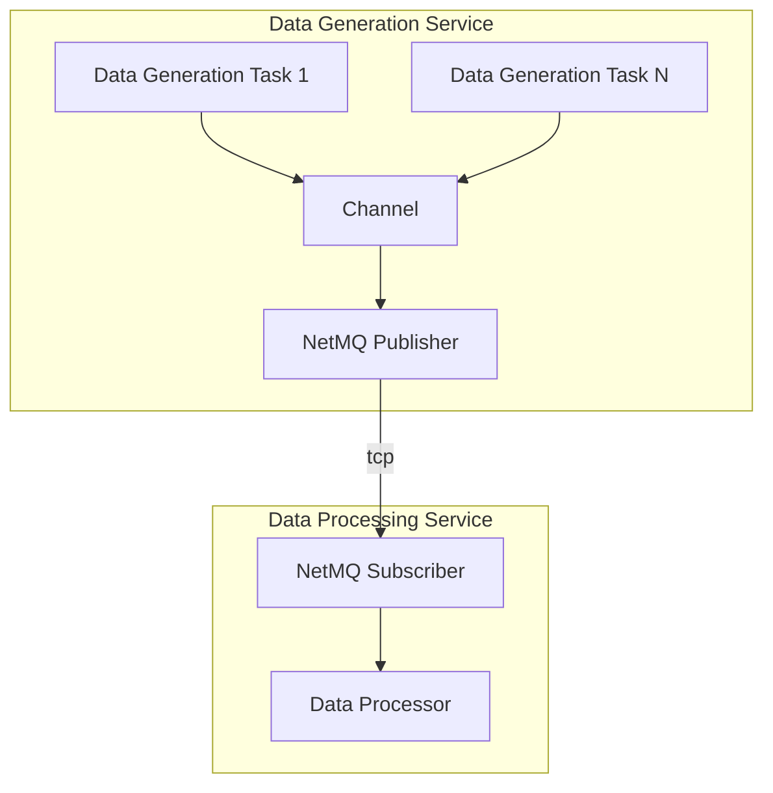

# ZeroMQPubSubSample

Example of using NetMQ ( ZeroMQ C# port) in publish–subscribe scenario.



## Components

- **Data Generation Service**: Responsible for generating data through multiple tasks. These tasks push data through a channel to the NetMQ Publisher.
- **Data Processing Service**: Processes the received data from the NetMQ Subscriber.

## Configuration

### Data Generation Service

The **Data Generation Service** is configured using the following structure in the configuration file. Each generator represents a specific task responsible for generating data at a defined interval.

```json
{
  "Generators": {
    "Generator1": {
      "GenerationPeriodSeconds": "00:00:05",
      "TaskId": 1,
      "Destination": "Main"
    },
    "Generator2": {
      "GenerationPeriodSeconds": "00:00:15",
      "TaskId": 2,
      "Destination": "Main"
    }
  }
}
```

### Explanation

- **Generator1** and **Generator2**: These represent two example generators that generate data at different intervals.
- **GenerationPeriodSeconds**: The time interval between data generation events.
  - **Example**: `"00:00:05"` means a 5-second interval.
- **TaskId**: A unique identifier for the task.
  - **Example**: TaskId `1` for Generator1.
- **Destination**: The topic where the generated data will be sent.
  - **Example**: `"Main"`.
    
### Data Processing Service

The **Data Processing Service** subscribes to the data published by the Data Generation Service using the following structure in the configuration file.

```json
{
  "MessageReceiverConfiguration": {
    "Address": "tcp://localhost:12345",
    "ReceiveHighWatermark": 100,
    "Topic": "Main"
  }
}
```

### Explanation

- **Address**: Specifies the TCP address that the processor uses to connect to the NetMQ publisher.
  - **Example**: `tcp://localhost:12345` means the processor is listening on the local machine (`localhost`) at port `12345`.
- **ReceiveHighWatermark**: Defines the maximum number of incoming messages that can be queued for processing. If the limit is reached, new messages will be discarded.
  - **Example**: A high watermark of `100` means the processor can queue up to 100 messages.
- **Topic**: Specifies the topic for which the processor will receive messages. This topic should match the destination topic used in the Data Generation Service configuration.
  - **Example**: The processor is configured to listen to the `"Main"` topic.


### Output


