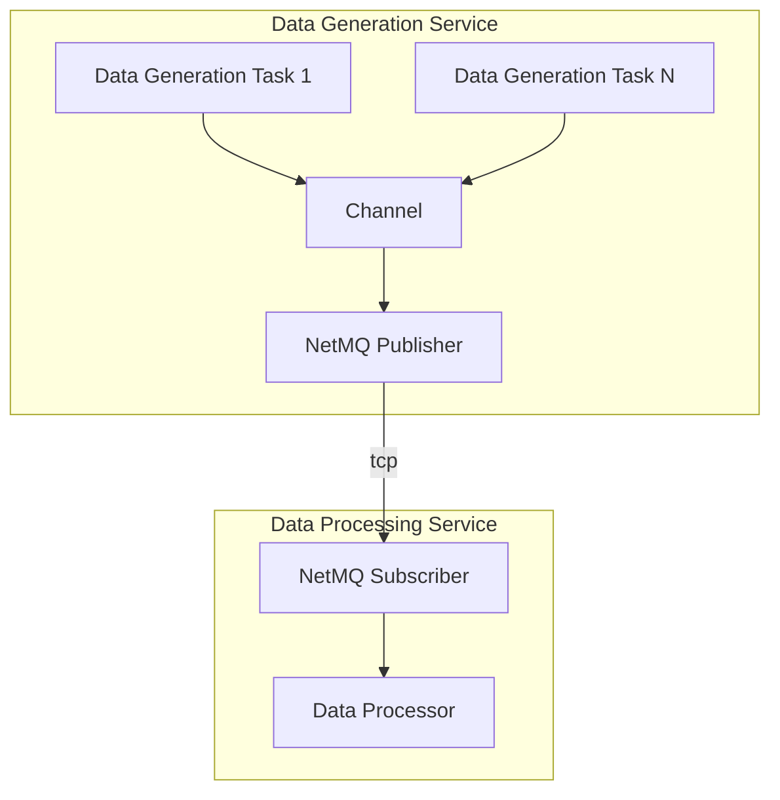

# ZeroMQPubSubSample

Example of using NetMQ ( ZeroMQ C# port) in publish–subscribe scenario.

## Components

- **Data Generation Service**: Responsible for generating data through multiple tasks. These tasks push data through a channel to the NetMQ Publisher.
- **NetMQ Publisher**: Publishes the data over TCP.
- **NetMQ Subscriber**: Subscribes to the data sent by the publisher.
- **Data Processing Service**: Processes the received data from the NetMQ Subscriber.

### Example

